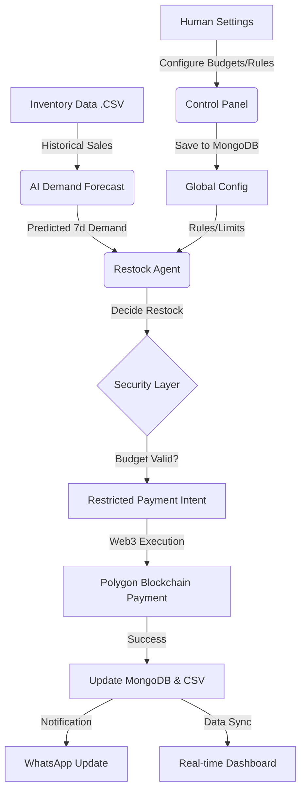

# 📦 StockEasy — Autonomous AI Inventory Management

**Empowering Commerce with Responsible, Agentic AI and Restricted Payment Intents.**

StockEasy is an end-to-end autonomous procurement system designed for modern businesses. It leverages AI agents to predict product demand, optimize stock levels under real-world budget constraints, and execute secure payments using restricted payment intents—ensuring that AI handles the heavy lifting without ever compromising financial security.

---

## � The Vision: Why StockEasy?

In the emerging AI economy, agents must move beyond simple "chats" and start performing real-world commerce. However, giving an AI unrestricted access to a wallet is a major security risk. 

**StockEasy solves this by separating Decision-making from Execution:**
- **The AI decides** *what* to buy, *when* to buy, and *how much* to spend based on data.
- **The System enforces** strict, human-defined limits (budgets, allowed merchants, safety rules).
- **The Result:** Autonomous efficiency with 100% human-defined safety and transparency.

---

## 🛠 Tech Stack

| Component | Technology |
|-----------|------------|
| **Frontend** | React, Vite, Lucide Icons, Recharts, Vanilla CSS |
| **AI Layer** | Python, FastAPI, Scikit-learn (Ridge Regression), Pandas |
| **Backend** | Node.js, Express, MongoDB (Atlas), Polygon (Web3) |
| **Automation** | APScheduler, WhatsApp API (Twilio) |

---

## 🧠 System Architecture & Workflow



### 1. Demand Forecasting (ML)
We use a **Ridge Regression** model trained on historical data to predict the next 7 days of demand for every SKU. 
- **Explainability:** We choose regression over "black-box" models to ensure decisions are auditable.
- **Accuracy:** Current models achieve an R² of ~0.95 with low MAE (~2.7 units).

### 2. Autonomous Decision Engine
The agent evaluates every product in the inventory and asks: 
- *Is the current stock below the safety buffer?*
- *Do we have enough budget left for this supplier?*
- *Which products give the best ROI for our remaining budget?*

### 3. Restricted Payments (Web3)
Instead of the agent holding a private key, it generates a **Restricted Payment Intent**. The backend verifies this intent against human-defined policies before settling the payment on the **Polygon (PoS)** network.

---

## 📱 Features

- **Dynamic Control Panel:** Set monthly budgets, buffer stocks, and minimum demand thresholds in real-time.
- **Real-time Dashboard:** Advanced analytics showing restock trends, budget usage, and stock health.
- **System Status Card:** Quick overview of AI activity, active SKUs, and network status.
- **Smart Spacing & Animation:** Premium UI with a custom green theme and smooth workflow animations.
- **WhatsApp Notifications:** Get instant updates on your phone whenever the agent completes a restock cycle, including detailed itemized lists.

---

## 🏁 Getting Started

### 1. AI Layer (FastAPI & ML)
```bash
cd ai
python -m venv .venv
source .venv/bin/activate  # Or .venv\Scripts\activate on Windows
pip install -r requirements.txt
python -m ml.train         # Train the demand forecasting model
python -m uvicorn api:app --reload
```

### 2. Backend (Node.js & MongoDB)
```bash
cd backend
npm install
# Configure your .env with MONGO_URI, TWILIO_SID, and PRIVATE_KEY
npm start
```

### 3. Frontend (Vite & React)
```bash
cd frontend/STOCK_EASY
npm install
npm run dev
```

---

## 🔐 Environment Variables
Create a `.env` file in the `backend` folder:
```env
MONGO_URI=your_mongodb_uri
TWILIO_ACCOUNT_SID=your_sid
TWILIO_AUTH_TOKEN=your_token
TWILIO_WHATSAPP_NUMBER=your_number
USER_WHATSAPP_NUMBER=target_number
PRIVATE_KEY=your_wallet_key
API_BASE_URL=http://localhost:8000
```

---

## 📄 License
© 2026 StockEasy. Built for the AI Economy.
